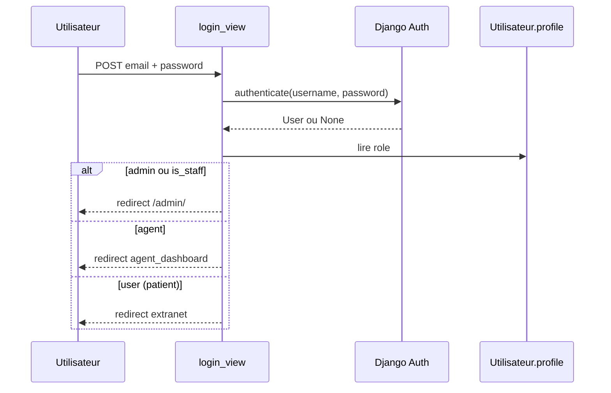

# Architecture du projet

## Objectif métier

Le système permet à un **cabinet dentaire** de :

- Présenter une vitrine publique (services, horaires).
- Laisser les **patients** s'inscrire, réserver, modifier ou annuler des rendez-vous.
- Gérer une **file d'attente** avec priorités (urgent en premier).
- Permettre aux **agents** (réception) d'appeler le prochain patient, valider ou annuler des RDV.
- Donner aux **admins** la supervision via Django Admin et un tableau de bord statistiques.

## Pattern architectural : MVT (Django)

```
┌─────────────┐     HTTP      ┌──────────────┐     ORM      ┌─────────────┐
│  Navigateur │ ────────────► │    Views     │ ───────────► │   Models    │
│  (HTML/JS)  │ ◄──────────── │  (rdv/views) │ ◄─────────── │ (rdv/models)│
└─────────────┘   Templates   └──────────────┘              └─────────────┘
                      ▲                                              │
                      │                                              ▼
               ┌──────────────┐                              ┌─────────────┐
               │  Templates   │                              │    MySQL    │
               │ rdv/templates│                              │ gestion_rdv │
               └──────────────┘                              └─────────────┘
```

- **Modèle** : entités métier (`Rendez_vous`, `Patient`, `Service`, etc.) dans `rdv/models.py`.
- **Vue** : logique HTTP dans `rdv/views.py` (authentification, CRUD RDV, file d'attente).
- **Template** : rendu HTML dans `rdv/templates/rdv/`.

## Arborescence logique des modules

```
gestion_rdv/                    ← racine dépôt Git
├── backend/                    ← Django (Python)
│   ├── manage.py
│   ├── config/                 ← settings, urls, wsgi
│   └── rdv/                    ← modèles, vues, migrations
├── frontend/                   ← templates + static
│   ├── templates/rdv/
│   └── static/rdv/
├── docs/
└── requirements.txt
```

## Couches et responsabilités

| Couche | Fichiers | Rôle |
|--------|----------|------|
| Configuration | `backend/config/settings.py` | Apps, DB, sécurité, chemins frontend |
| Routage racine | `backend/config/urls.py` | `/admin/` + délégation à `rdv.urls` |
| Routage app | `rdv/urls.py` | Toutes les URLs métier |
| Domaine | `rdv/models.py` | Schéma, managers, signaux |
| Validation RDV | `rdv/forms.py` | Créneaux, règle 24 h, jours fermés |
| Présentation | `frontend/templates/`, `frontend/static/` | UI patient / agent / public |
| Admin Django | `rdv/admin.py` | CRUD back-office |
| Contexte global | `rdv/context_processors.py` | Nom affiché dans la barre nav |

## Flux d'authentification



À la création d'un `User`, un signal crée automatiquement un profil `Utilisateur`. Si le rôle est `user`, un `Patient` et un `Compte` sont créés.

## Flux de réservation d'un rendez-vous (patient)

1. Patient connecté accède à `/rdv/create/`.
2. `RendezVousForm` + `get_creneaux_table_semaine()` affichent une grille de créneaux (lun–ven, créneaux fixes ~50 min).
3. Le patient choisit un créneau ; `clean_date()` vérifie : créneau officiel, jour non fermé, pas déjà pris, date future.
4. Enregistrement : `Rendez_vous` avec `status=pending`, `utilisateur=request.user`.
5. Redirection vers `/mes-rendez-vous/`.

## Flux file d'attente (agent)

1. Tous les RDV `pending` sont triés : **urgent** d'abord, puis `date`, puis `created_at`.
2. `RendezVousManager.next_in_queue_agent_global()` privilégie les RDV **du jour** (fuseau cabinet), sinon file globale.
3. **Appeler prochain** : passe le RDV en `confirmed`.
4. **Valider** : passe en `done` (passage chez le médecin).
5. **Annuler** : passe en `cancelled`.

## Créneaux horaires : deux sources

| Source | Usage actuel |
|--------|----------------|
| **Constantes** dans `forms.py` (`CRENEAUX_MATIN`, `CRENEAUX_APRES`) | Génération des créneaux réservables côté patient |
| **Modèles** `HoraireCabinet`, `CreneauHoraire` | Config admin / documentation métier ; commande `copier_horaires` |

Les créneaux de réservation en ligne suivent la logique codée dans `heures_pour_jour_semaine()` (lun–jeu journée complète, ven matin seulement, sam–dim fermé).

## Sécurité (settings)

- `SECRET_KEY`, `DEBUG`, `ALLOWED_HOSTS` via variables d'environnement (voir `.env.example`).
- Cookies session : `HttpOnly`, `SameSite=Lax`, `Secure` si `DEBUG=False`.
- Validators mot de passe : minimum 8 caractères.
- Vues admin dashboard : décorateur `@staff_member_required`.
- Vues agent : contrôle `_is_agent()` (rôle `agent` ou `is_staff`).

## Middleware Django (ordre)

1. `SecurityMiddleware`
2. `SessionMiddleware`
3. `CommonMiddleware`
4. `CsrfViewMiddleware`
5. `AuthenticationMiddleware`
6. `MessageMiddleware`
7. `ClickjackingMiddleware`

## Intégration MySQL

`backend/config/__init__.py` enregistre `pymysql` comme driver `MySQLdb` pour que Django se connecte à MySQL sans compiler `mysqlclient`.

## Points d'extension possibles

- Brancher la réservation sur `HoraireCabinet` / `CreneauHoraire` au lieu des constantes.
- Créer automatiquement des entrées `FileAttente` à chaque RDV `pending`.
- Exploiter `Compte.solde` pour la facturation patient.
- Tests automatisés (`rdv/tests.py` est vide pour l'instant).
