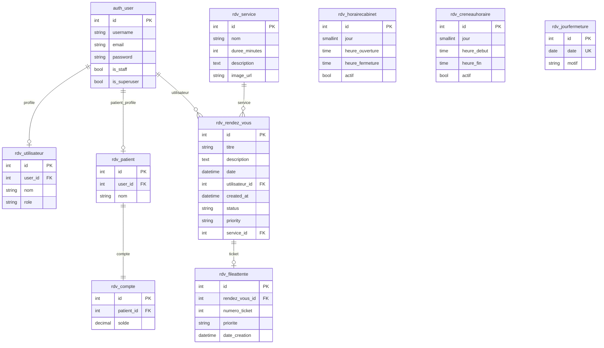

# Base de données

## Connexion

| Paramètre | Défaut (dev) | Variable d'environnement |
|-----------|--------------|---------------------------|
| Moteur | MySQL | — |
| Nom | `gestion_rdv` | `MYSQL_DATABASE` |
| Utilisateur | `root` | `MYSQL_USER` |
| Mot de passe | (vide) | `MYSQL_PASSWORD` |
| Hôte | `127.0.0.1` | `MYSQL_HOST` |
| Port | `3306` | `MYSQL_PORT` |
| Charset | `utf8mb4` | dans `OPTIONS` |

Configuration : `backend/config/settings.py` → `DATABASES['default']`.

## Schéma relationnel (app `rdv` + auth Django)



## Tables détaillées

### Tables Django système (préfixe selon installation)

Créées automatiquement : `django_migrations`, `django_session`, `django_content_type`, `auth_group`, `auth_permission`, `auth_user`, `auth_user_groups`, etc.

### `rdv_rendez_vous`

Rendez-vous patient.

| Colonne | Type | Contraintes | Description |
|---------|------|-------------|-------------|
| `id` | BIGINT AUTO | PK | Identifiant |
| `titre` | VARCHAR(200) | NOT NULL | Intitulé du RDV |
| `description` | TEXT | NOT NULL | Détail / motif |
| `date` | DATETIME | NOT NULL | Créneau réservé (timezone-aware) |
| `utilisateur_id` | INT | FK → `auth_user`, CASCADE | Patient propriétaire |
| `created_at` | DATETIME | auto | Date de création |
| `status` | VARCHAR(10) | défaut `pending` | `pending`, `confirmed`, `done`, `cancelled` |
| `priority` | VARCHAR(10) | défaut `normal` | `normal`, `urgent`, `control` |
| `service_id` | BIGINT | FK → `rdv_service`, SET NULL, nullable | Service dentaire lié |

**Index métier** : un créneau (`date` exacte) ne doit pas être double-booké (contrôle applicatif dans `forms.py`).

### `rdv_utilisateur`

Profil rôle (extension de `User`).

| Colonne | Type | Description |
|---------|------|-------------|
| `id` | BIGINT PK | |
| `user_id` | INT FK UNIQUE | Lien 1–1 `auth_user` |
| `nom` | VARCHAR(150) | Nom affiché |
| `role` | VARCHAR(10) | `admin`, `agent`, `user` |

### `rdv_patient`

Profil patient métier.

| Colonne | Type | Description |
|---------|------|-------------|
| `id` | BIGINT PK | |
| `user_id` | INT FK UNIQUE | Même utilisateur que connexion |
| `nom` | VARCHAR(150) | Nom complet patient |

### `rdv_compte`

Compte financier patient (prévu pour facturation).

| Colonne | Type | Description |
|---------|------|-------------|
| `id` | BIGINT PK | |
| `patient_id` | INT FK UNIQUE | 1 compte par patient |
| `solde` | DECIMAL(10,2) | Solde, défaut `0.00` |

### `rdv_service`

Catalogue des prestations (vitrine + formulaire RDV).

| Colonne | Type | Description |
|---------|------|-------------|
| `id` | BIGINT PK | |
| `nom` | VARCHAR(150) | Ex. Consultation, Détartrage |
| `duree_minutes` | INT UNSIGNED | Durée indicative, défaut 30 |
| `description` | TEXT | Texte libre |
| `image_url` | VARCHAR(200) | URL image carte accueil |

### `rdv_horairecabinet`

Plages d'ouverture du cabinet par jour de semaine (0 = lundi … 6 = dimanche).

| Colonne | Type | Description |
|---------|------|-------------|
| `jour` | SMALLINT | Choix JOURS |
| `heure_ouverture` | TIME | |
| `heure_fermeture` | TIME | |
| `actif` | BOOL | défaut True |

### `rdv_creneauhoraire`

Créneaux configurables (modèle parallèle, admin).

| Colonne | Type | Description |
|---------|------|-------------|
| `jour` | SMALLINT | |
| `heure_debut` | TIME | |
| `heure_fin` | TIME | |
| `actif` | BOOL | |

### `rdv_jourfermeture`

Exceptions : jours où le cabinet est fermé (bloque la réservation).

| Colonne | Type | Description |
|---------|------|-------------|
| `date` | DATE | UNIQUE |
| `motif` | VARCHAR(200) | Optionnel |

### `rdv_fileattente`

Ticket file d'attente (lien optionnel 1–1 avec un RDV).

| Colonne | Type | Description |
|---------|------|-------------|
| `rendez_vous_id` | BIGINT FK | nullable |
| `numero_ticket` | INT UNSIGNED | Numéro affiché |
| `priorite` | VARCHAR(10) | `normal`, `urgent`, `control` |
| `date_creation` | DATETIME | auto |

> La file affichée en production utilise surtout les `Rendez_vous` en `pending` ; `FileAttente` est géré en admin et partiellement à l'annulation patient.

## Migrations (historique)

| Fichier | Contenu principal |
|---------|-------------------|
| `0001_initial` | `Rendez_vous` de base |
| `0002_alter_rendez_vous_id` | Passage id → BigAutoField |
| `0003_utilisateur` | Modèle `Utilisateur` + profils |
| `0004_...` | `status`, `priority` sur RDV |
| `0005_...` | `Service`, `CreneauHoraire`, FK `service` |
| `0006_structure_diagramme_classe` | `Patient`, `Compte`, `FileAttente`, `JourFermeture`, `HoraireCabinet` |
| `0007_fix_admin_agent_users` | Comptes admin/agent de démo |
| `0008_service_image_url` | Champ `image_url` sur Service |
| `0009_set_horaires_cabinet` | Données initiales horaires |

Commandes utiles :

```powershell
py backend\manage.py migrate
py backend\manage.py showmigrations rdv
py backend\manage.py copier_horaires
```

## Tables auth Django (`auth_user`)

Champs utilisés par l'application :

- `username` : souvent l'email à l'inscription.
- `email` : connexion par email.
- `first_name`, `last_name` : signup patient.
- `password` : hash Django.
- `is_staff`, `is_superuser` : accès admin.

## Intégrité et suppressions

| Relation | on_delete | Effet |
|----------|-----------|-------|
| RDV → User | CASCADE | Supprimer user supprime ses RDV |
| RDV → Service | SET NULL | Supprimer service garde le RDV |
| Patient → User | CASCADE | |
| Compte → Patient | CASCADE | |
| FileAttente → RDV | CASCADE | |

## Fuseau horaire

`TIME_ZONE = 'Africa/Casablanca'` — toutes les comparaisons « aujourd'hui » et créneaux passent par `timezone.localtime()` et `ZoneInfo`.
